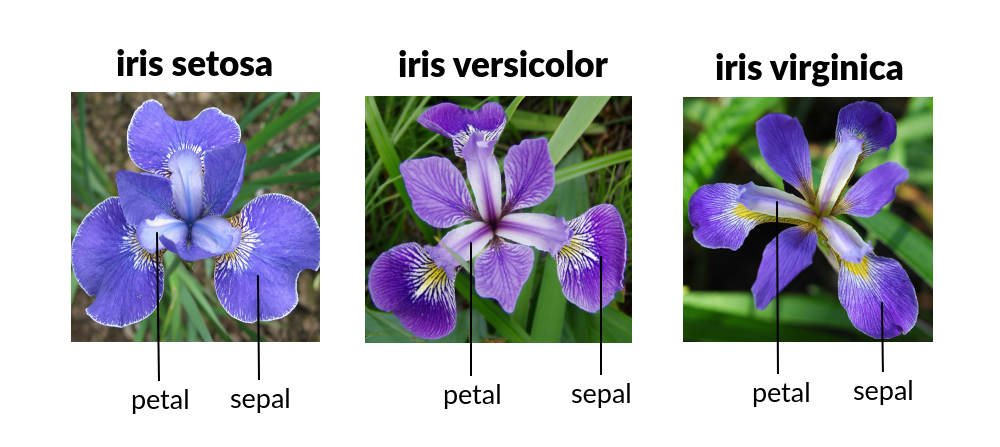

```{r setup, include=FALSE}
library(learnr)
library(car)
# library(dplyr)
library(ggplot2)
knitr::opts_chunk$set(echo = FALSE)

```

## Our research question {data-progressive=TRUE}
Today want to consider the following question:

> Does the ***species*** of an iris plant have an association with the mean width of its ***sepals***?

<center><figure></img>
<figcaption>Fig.1 - Labeled Irises by Species <a href="https://www.datacamp.com/tutorial/machine-learning-in-r">(source)</a></figcaption></figure></center>

### Explore the data!
Run the code below to explore the data frame.  Remember you can use the small, black triangle in the upper right to view more variables (columns), and you can hit the "Next" button to view more observations (rows).
```{r explore, exercise = TRUE, exercise.lines = 2}
iris
```

Please review the following definitions before completing the follow-up questions:

* **Independent variable:** this is typically a variable that researchers have some control over, and they let it vary to test for some sort of response in the *dependent variable.*

* **Dependent variable:** this is typically a variable that researchers use to measure the response to differences in an *independent variable*. The researchers cannot (and should not) control what the dependent variable is doing!

```{r variable-question}
quiz(
    question("Based on the definition above, which variable in the data frame is the *independent variable*? ",
    answer("Sepal.Width", message="This is an important variable, but the scientists are not choosing flowers to get specific sepal widths. They are not exercising any control over this variable."),
    answer("Sepal.Length", message="This variable is not related to our research question. (We did use it as an example though.)"),
    answer("Species", correct = TRUE),
    answer("Petal.Length", message="This variable is not related to our research question."),
    answer("Petal.Width",message="This variable is not related to our research question."),
    answer("Sample_ID", message="This is not a variable in our data frame."),
    allow_retry = T,
    random_answer_order = T,
    incorrect = paste(random_encouragement(),"Remember we are looking for differences in the *sepal* widths between setosa, virginica, and versicolor irises. The scientists specifically collected samples from each species of iris, exercising some control over that aspect of the study."),
    post_message = random_praise()
  ),

    question("Based on the definitions above, which variable in the data frame is the *dependent variable*?",
        answer("Sepal.Width", correct=TRUE),
        answer("Sepal.Length", message="This variable is not related to our research question. (We did use it as an example though.)"),
        answer("Species", message="We do not typically think of the species of a flower as *responding* to the variation in some other variable."),
        answer("Petal.Length", message="This variable is not related to our research question."),
        answer("Petal.Width",message="This variable is not related to our research question."),
        answer("Sample_ID", message="This is not a variable in our data frame."),
        allow_retry = T,
        random_answer_order = T,
        incorrect = paste(random_encouragement(),"Remember we are looking for differences in the *sepal* widths between setosa, virginica, and versicolor irises. The researchers collected different species already; what *measurement* will they use to compare these samples?"),
        post_message = random_praise()
      )
)
```


### Summarizing the data
Before doing inferential statistics, let's summarize the pertinent data by comparing means across species, and by creating a comparative box-plot.

#### Exercise!
The code below generates this explorative information, *but for petal length*. ***Make the appropriate changes to the code to work for `Sepal.Width` instead.***
```{r explore2, exercise = TRUE, exercise.lines = 5}
# Sepal length means by species
tapply(iris$Petal.Length, iris$Species, mean)
# boxplot
boxplot(Petal.Length~Species, data = iris)
```
```{r explore2-hint-1}
# Petal Width means by species
tapply(iris$..., iris$Species, mean)
# boxplot
boxplot(...~Species, data = iris)
```
```{r explore2-hint-2}
# Petal Width means by species
tapply(iris$Sepal.Width, iris$Species, mean)
# boxplot
boxplot(...~Species, data = iris)
```
```{r explore2-solution}
# Petal Width means by species
tapply(iris$Sepal.Width, iris$Species, mean)
# boxplot
boxplot(Sepal.Width~Species, data = iris)
```

```{r why-anova-question}
question("Which of the following statements explain(s) why we need to use ANOVA rather than a different statistical test? <br> *Select all that apply.*",
    answer("We are interested in comparing the means for a quantitative measurement across several groups.", correct=TRUE),
    answer("The independent variable is a grouping variable with at least *three* groups (sometimes called \"levels\").", correct = TRUE),
    answer("The variance of the groups are all about the same.", message = "While the details of ANOVA involve variance, it does test for differences in means."),
    answer("Our box-plots do not seem to overlap much, and the group means are seemingly different.", message = "We still use ANOVA to do our statistical testing regardless of what the summarized data reports."),
    answer("We should not use an ANOVA for this analysis.", message = "ANOVA is in fact the right analysis approach for this research question and data."),
    allow_retry = T,
    random_answer_order = T,
    post_message = random_praise()
  )
```

## Preparing for ANOVA

Check for "balance"
```{r}
table(iris$Species)
```

Assumptions of ANOVA:

* Normality of residuals (or normality within groups)
* equal variances/sd within groups

Initial fit
```{r}
iris.aov<-aov(Sepal.Width ~ Species, data = iris)
```


## Checking assumptions, part 1

Checking residuals versus fitted for groups

```{r}
plot_resids_anova<-function(formula, data,dec=3){
    IV<-all.vars(formula)[2]
    DV<-all.vars(formula)[1]
    sds<-tapply(data[[DV]],data[[IV]],sd)
    levs<-levels(data[[IV]])
    aov.model<-aov(formula(paste(DV,IV,sep="~")), data = data)
    M<-max(aov.model$residuals)
    m<-min(aov.model$residuals)
    ggplot(data = data.frame(x=data[[IV]],
                         y=aov.model$residuals),
       aes(x=x,
           y=y,
           color=x))+
    geom_hline(yintercept=0)+
    geom_boxplot(aes(fill=x),alpha=.3, color=NA)+
    # geom_stripchart()
    geom_point(position=position_jitter(width=.1), alpha=.6)+theme_bw()+labs(y="residuals",x="fitted values", title=paste("Residual Versus Fitted Plot,",DV,"~",IV),
                                                                              subtitle="(Boxes represent interquartile ranges)")+ scale_y_continuous(limits=c(m-.1,M+.12))+
    # print(paste(levs," (stdev = ",round(sds,3),")",sep=""))
    # +
        scale_color_discrete(IV,labels=paste(levs,"\n(stdev = ",round(sds,dec),")\n",sep=""))+
        scale_fill_discrete(guide="none")
    
    # annotate("text",x=levs, y=rep(M+.1,length(levs)),
    #          label=paste("stdev =",round(sds,3)))
}

plot_resids_anova(weight~feed, chickwts)
plot_resids_anova(Petal.Width~Species,iris)

```

```{r}
with(iris,
    tapply(Sepal.Width, Species, sd)
)
```


```{r}
leveneTest(Sepal.Width~Species,
           center="mean", data = iris)
```

P-value < 0.05, indicating we have do not have evidence the variances are  unequal.  


## Checking assumptions, part 2
normality
```{r}
hist(iris.aov$residuals)
```

```{r}
library(ggplot2)
iris.aov<-aov(Sepal.Width~Species, data =iris)
plot(iris.aov, which =2)
```

```{r}
shapiro.test(iris.aov$residuals)
```

```{r}
with(iris,
     tapply(Sepal.Width, Species, hist))

library(ggplot2)
ggplot(data = iris,
       aes(x = Sepal.Width))+
    geom_histogram(bins =5)+
    facet_grid(Species~., scales="free")
```


## Planning for final analysis
No seeming issues with homoscedasticity or normality of residuals; the design is perfectly balanced, and we have good sample sizes.  A standard ANOVA should do the trick!

## Final analysis and interpretation
```{r}
summary(iris.aov)
```
Evidence suggests at least one population mean is different from the others

```{r}
TukeyHSD(iris.aov)
```

All three appear different from each other

